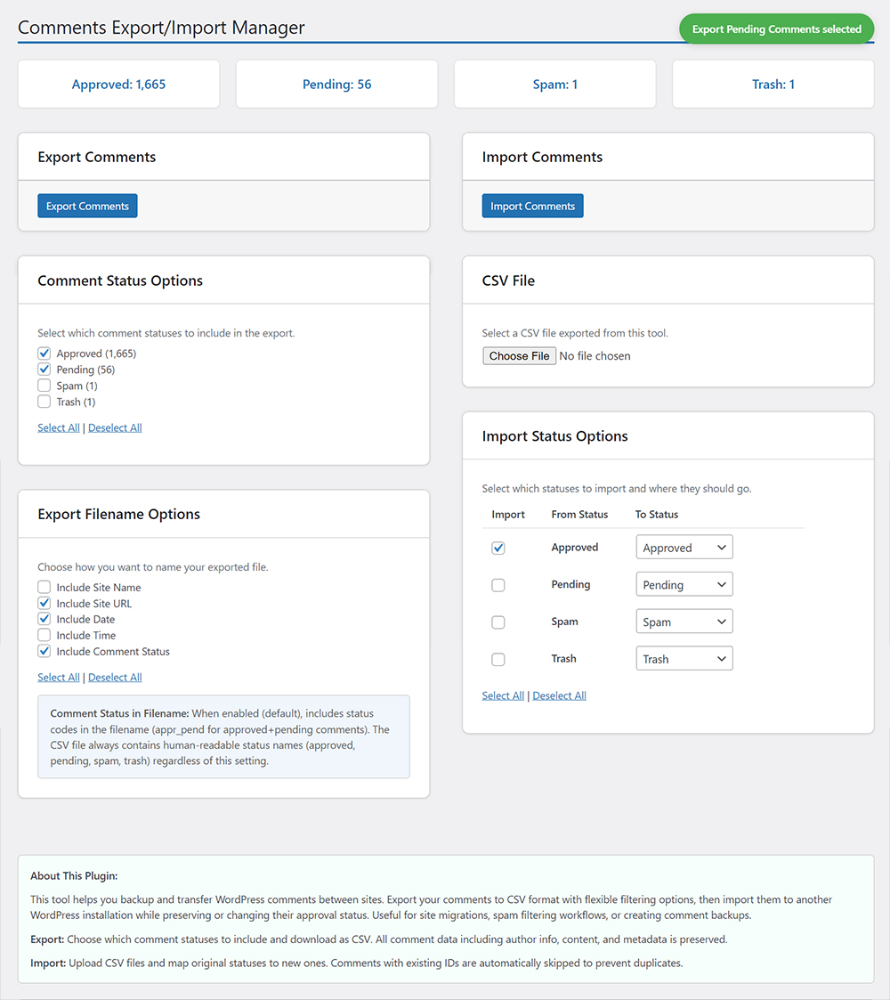

# Comments Export/Import Manager

A powerful WordPress plugin for exporting and importing comments with flexible filtering and status mapping options. Perfect for site migrations, spam filtering workflows, and comment backups.


## 🚀 Features

### Export Features
- **Selective Status Export**: Choose specific comment statuses to export (Approved, Pending, Spam, Trash)
- **Flexible Filename Options**: Customize export filenames with site name, URL, date, time, and status information
- **Complete Data Preservation**: Exports all comment metadata including author info, timestamps, and content
- **CSV Format**: Industry-standard CSV format for maximum compatibility
- **Comment Statistics**: View current comment counts by status before export

### Import Features
- **Smart Status Mapping**: Map imported comment statuses to new statuses during import
- **Enhanced Duplicate Prevention**: Comprehensive duplicate detection using multiple criteria
- **Detailed Import Reporting**: Clear notifications showing what was imported vs. skipped
- **Flexible File Support**: Compatible with CSV files from this plugin or other WordPress exports
- **Validation & Error Handling**: Robust validation with user-friendly error messages

### User Experience
- **Persistent Preferences**: Plugin remembers your export/import preferences across sessions
- **Real-time Notifications**: Instant feedback with bubble notifications for all actions
- **Clean Interface**: Intuitive admin interface with helpful descriptions and select all/deselect all options
- **Mobile Responsive**: Works seamlessly on desktop and mobile devices

## 📸 Screenshots

### Main Interface
The plugin provides a clean, organized interface with export and import sections:



## 🛠️ Installation

### From WordPress Admin
1. Go to `Plugins > Add New`
2. Search for \"Comments Export/Import Manager\"
3. Install and activate the plugin
4. Navigate to `Comments > Export/Import`

### Manual Installation
1. Download the plugin files
2. Upload to `/wp-content/plugins/tr-comments-import-export/`
3. Activate through the WordPress admin panel
4. Go to `Comments > Export/Import` to start using

### Via WP-CLI
```bash
wp plugin install tr-comments-import-export --activate
```

## 🎯 Usage

### Exporting Comments

1. **Navigate to Export Section**
   - Go to `Comments > Export/Import`
   - Locate the \"Export Comments\" section

2. **Select Comment Statuses**
   - Choose which statuses to include: Approved, Pending, Spam, Trash
   - Use \"Select All\" or \"Deselect All\" for quick selection
   - See live comment counts for each status

3. **Customize Filename** (Optional)
   - Include/exclude site name, URL, date, time
   - Include comment status codes in filename
   - Preview shows how your filename will look

4. **Export**
   - Click \"Export Comments\"
   - CSV file downloads automatically
   - Filename example: `mysite.com_comments_appr_pend_2025-05-31_14-30-25.csv`

### Importing Comments

1. **Prepare CSV File**
   - Use CSV exported from this plugin
   - Or create compatible CSV with required headers
   - Ensure proper encoding (UTF-8 recommended)

2. **Select Import File**
   - Click \"Choose File\" in Import section
   - Select your CSV file
   - File validation occurs automatically

3. **Configure Status Mapping**
   - Choose which statuses to import
   - Map each original status to desired new status
   - Example: Import \"Spam\" comments as \"Pending\" for review

4. **Import**
   - Click \"Import Comments\"
   - View detailed results showing:
     - Number of comments imported
     - Number of duplicates skipped
     - Status breakdown of imported comments

## 🔧 Technical Details

### CSV Format

The plugin uses a standardized CSV format with the following headers:

```csv
comment_ID,comment_post_ID,comment_author,comment_author_email,comment_author_url,comment_author_IP,comment_date,comment_date_gmt,comment_content,comment_karma,comment_approved,comment_agent,comment_type,comment_parent,user_id
```

### Duplicate Detection

The plugin uses a comprehensive duplicate detection system:

1. **Primary Check**: Comment ID matching
2. **Secondary Check**: Content + Author + Email + Post ID + Date combination
3. **Flexible Matching**: Handles comments with or without IDs
4. **Data Validation**: Sanitizes and validates all fields before comparison

### Database Operations

- All operations use prepared statements for security
- Bulk operations optimized for performance
- Transactional safety for large imports
- Proper WordPress hooks and filters integration

## 🔌 Developer Hooks

The plugin provides hooks for developers:

**Actions:** `tr_cei_before_export`, `tr_cei_after_export`, `tr_cei_before_import`, `tr_cei_after_import`

**Filters:** `tr_cei_export_query`, `tr_cei_export_filename`, `tr_cei_validate_import_data`, `tr_cei_is_duplicate_comment`

## 🚨 Troubleshooting

**Export Issues:**
- Verify comments exist for selected statuses
- Check server file download permissions

**Import Issues:**
- Check file size limits and CSV format
- Increase `max_execution_time` for large imports
- Verify CSV headers match expected format

## 🤝 Contributing

We welcome contributions! Here's how you can help:

### Reporting Issues
1. Check existing issues on GitHub
2. Provide detailed bug reports with:
   - WordPress version
   - PHP version
   - Plugin version
   - Steps to reproduce
   - Expected vs actual behavior

### Feature Requests
1. Search existing feature requests
2. Describe the use case clearly
3. Explain the expected functionality
4. Consider backward compatibility

### Code Contributions
1. Fork the repository
2. Create a feature branch (`git checkout -b feature/amazing-feature`)
3. Follow WordPress coding standards
4. Write clear commit messages
5. Submit a pull request

### Coding Standards
- Follow [WordPress Coding Standards](https://developer.wordpress.org/coding-standards/)
- Use meaningful variable and function names
- Add inline documentation for complex logic
- Test on multiple WordPress versions

## 📋 Requirements

### System Requirements
- **WordPress**: 5.0 or higher
- **PHP**: 7.4 or higher
- **MySQL**: 5.6 or higher (or MariaDB equivalent)

### Server Requirements
- **Memory**: 256MB minimum (512MB recommended for large imports)
- **Execution Time**: 60 seconds minimum for imports
- **File Upload**: 32MB minimum for large CSV files

### Browser Compatibility
- Chrome 80+
- Firefox 75+
- Safari 13+
- Edge 80+

## 📞 Support & Documentation

### Getting Help
- **Documentation**: Check this README and plugin help text
- **WordPress Support**: [WordPress.org Plugin Support](https://wordpress.org/support/plugin/tr-comments-import-export/)
- **GitHub Issues**: [Report bugs and request features](https://github.com/lso2/tr-comments-import-export/issues)
- **Author Website**: [TechReader.com](https://techreader.com)

### Premium Support
For priority support, custom development, or consulting:
- Visit [TechReader.com](https://techreader.com)
- Email: support@techreader.com

## 💖 Support Development

If this plugin has been helpful, consider supporting its development:

[](https://techreader.com/donate)

Your support helps:
- Keep the plugin free and updated
- Add new features based on user feedback
- Provide community support
- Maintain compatibility with new WordPress versions

## 📄 License

This plugin is licensed under the [GPLv3](http://www.gnu.org/licenses/gpl-3.0.html).

```
Copyright (C) 2025 TechReader

This program is free software: you can redistribute it and/or modify
it under the terms of the GNU General Public License as published by
the Free Software Foundation, either version 3 of the License, or
(at your option) any later version.

This program is distributed in the hope that it will be useful,
but WITHOUT ANY WARRANTY; without even the implied warranty of
MERCHANTABILITY or FITNESS FOR A PARTICULAR PURPOSE. See the
GNU General Public License for more details.
```

## 🏷️ Changelog

### Version 1.7.7 (Current)
- Security improvements with static prepared statements and enhanced caching
- Complete WordPress coding standards compliance for database operations
- Final resolution of all plugin check database warnings

### Version 1.6.0
- **MAJOR IMPROVEMENT**: Enhanced duplicate detection system
- **NEW**: Comprehensive duplicate checking using multiple criteria
- **NEW**: Detailed import notifications with skip reason breakdown
- **IMPROVED**: Better error handling and validation
- **TECHNICAL**: Refactored import logic for better performance

### Version 1.5.0
- Persistent checkbox selections across page loads
- Export filename customization options
- Better notifications and user experience

[View complete changelog in readme.txt](readme.txt)

## 🔮 Roadmap

**Planned Features:**
- Advanced filtering by date ranges, authors, keywords
- Additional export formats (JSON, XML)
- Automated scheduling
- REST API endpoints

**Under Consideration:**
- Multi-site support
- Custom fields support
- Advanced field mapping

---

**Made with ❤️ by [TechReader](https://techreader.com)**

If this plugin has been helpful, consider supporting development at [https://techreader.com/donate](https://techreader.com/donate).
